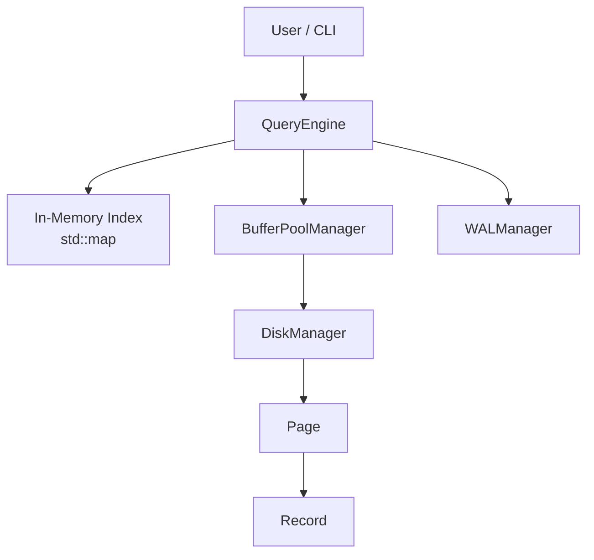
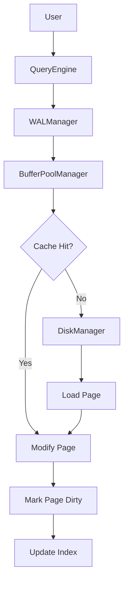
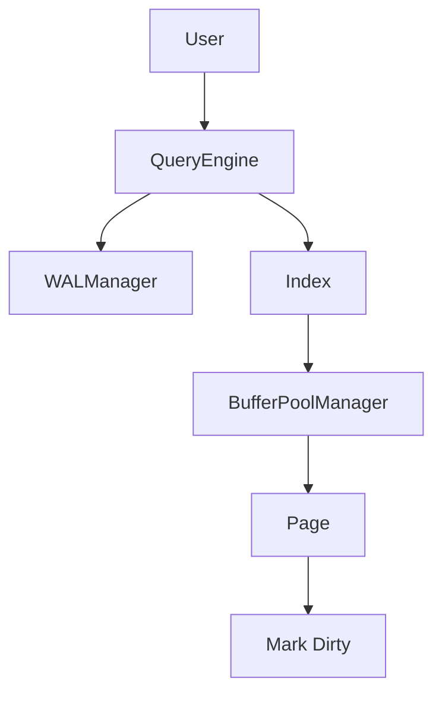
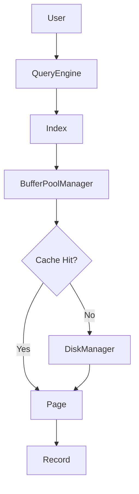
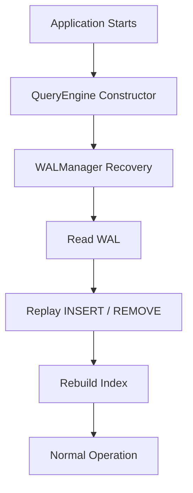

# PersistX Architecture

## Overview

PersistX is an educational storage engine built in C++17.

It stores data as key-value records organized into fixed-size pages. The system demonstrates core storage-engine concepts including page-based storage, buffer pool management, disk persistence, write-ahead logging, crash recovery, and in-memory indexing.

---

## Architecture Diagram



The system is divided into components with focused responsibilities:

| Component | Responsibility |
|---|---|
| **QueryEngine** | Coordinates database operations and maintains the in-memory index |
| **Index** | In-memory `std::map` mapping keys to page IDs |
| **BufferPoolManager** | Caches pages in memory and performs LRU-style eviction |
| **WALManager** | Logs operations and replays them during crash recovery |
| **DiskManager** | Handles persistent page I/O |
| **Page** | Fixed-size unit containing records |
| **Record** | Represents an individual key-value pair |

---

# Component Responsibilities

## QueryEngine

### Purpose

Provides the main database interface and coordinates operations across the storage components.

### Responsibilities

- Handles insert, search, and remove operations
- Maintains the in-memory index
- Performs prefix searches
- Performs lexicographic range queries
- Initiates WAL logging
- Initiates recovery during startup

### Uses

- `BufferPoolManager`
- `WALManager`
- In-memory `std::map` index

### Does Not Handle

- Page caching and eviction
- Direct disk I/O
- Page serialization/deserialization

---

## BufferPoolManager

### Purpose

Manages an in-memory cache of pages to reduce repeated disk access.

### Responsibilities

- Caches pages in memory
- Tracks page access timestamps
- Tracks dirty pages
- Loads pages from disk on cache misses
- Evicts pages using an LRU-style replacement policy
- Flushes dirty pages to disk before eviction

### Internal Data Structures

The buffer pool uses:

- An `unordered_map` to locate cached pages by page ID
- A min-heap to identify the least recently accessed page
- Timestamps to implement the LRU-style policy

### Uses

- `DiskManager`

### Does Not Handle

- Query processing
- Direct application-level query logic
- WAL management

---

## DiskManager

### Purpose

Handles persistent storage and direct disk I/O.

### Responsibilities

- Reads pages from disk
- Writes pages to disk
- Serializes pages when writing
- Deserializes pages when reading
- Manages page files under the `data/` directory

### Storage Format

Pages are stored as individual files:

```text
data/
├── page_0.txt
├── page_1.txt
├── page_2.txt
└── ...
```

### Uses

- `Page`
- `Record`

### Does Not Handle

- Query processing
- Buffer pool management
- Page eviction
- WAL recovery logic

---

## WALManager

### Purpose

Provides operation logging and crash recovery.

### Responsibilities

- Logs `INSERT` operations
- Logs `REMOVE` operations
- Reads the WAL during recovery
- Replays logged operations
- Enables recovery mode during replay
- Prevents recovery operations from being logged recursively
- Clears the WAL after recovery

### WAL Format

The WAL stores logical operations such as:

```text
INSERT|alice|hello
REMOVE|alice
```

The log is stored in:

```text
data/wal.log
```

### Uses

- `QueryEngine`

### Does Not Handle

- Page caching
- Page eviction
- Direct page serialization
- Query indexing

---

## Page

### Purpose

Represents the fixed-size unit of storage used by PersistX.

### Responsibilities

- Stores a collection of records
- Supports insertion
- Supports deletion
- Supports key lookup
- Tracks page ID
- Tracks current page size
- Provides access to stored records

### Storage Size

Each page has a maximum size of:

```text
4096 bytes
```

### Uses

- `Record`

### Does Not Handle

- Disk I/O
- Buffer pool management
- Query processing
- WAL management

---

## Record

### Purpose

Represents a single key-value pair stored in a page.

### Structure

```text
Record
├── key
└── value
```

### Responsibilities

- Stores a key
- Stores a value
- Provides record data to the page layer
- Supports serialization/deserialization

### Does Not Handle

- Page management
- Disk persistence
- Query processing
- Buffer management

---

## In-Memory Index

### Purpose

Provides efficient exact-key lookup without scanning every page.

### Implementation

The index is maintained inside `QueryEngine` using:

```cpp
std::map<string, int>
```

The mapping is:

```text
key → page ID
```

This allows exact key searches to identify the relevant page without scanning every page.

The ordered structure also supports lexicographic traversal for range queries.

### Responsibilities

- Maps keys to the pages containing them
- Updates mappings after inserts
- Removes mappings after deletes
- Locates the relevant page for exact searches
- Supports ordered traversal for range queries

### Limitations

The index is memory-resident and can be rebuilt from stored pages when required.

---

# Request Flows

## Insert Operation



### Flow

1. The user issues an `INSERT`.
2. `QueryEngine` logs the operation through `WALManager`.
3. `BufferPoolManager` locates or loads the relevant page.
4. The page is modified.
5. The page is marked dirty.
6. The in-memory index is updated.

---

## Delete Operation



### Flow

1. The user issues a `DELETE`.
2. `QueryEngine` logs the removal operation.
3. The index identifies the relevant page.
4. `BufferPoolManager` retrieves the page.
5. The record is removed.
6. The page is marked dirty.
7. The key is removed from the index.

---

## Search Operation



### Flow

1. The user issues a `GET`.
2. `QueryEngine` checks the in-memory index.
3. The index provides the page ID.
4. `BufferPoolManager` checks whether the page is cached.
5. On a cache miss, `DiskManager` loads the page.
6. The page is searched for the requested key.
7. The value is returned.

---

# Buffer Pool and Eviction

The buffer pool uses an LRU-style replacement mechanism based on access timestamps.

When a page is accessed:

```text
Page accessed
     |
     v
Timestamp updated
     |
     v
New timestamp pushed into min-heap
```

Because old heap entries remain in the heap, each entry is checked against the page's current timestamp.

```text
Heap entry timestamp
        |
        v
Matches current page timestamp?
      /     \
    Yes      No
     |        |
  Candidate  Ignore stale entry
```

When the buffer pool reaches capacity:

```text
Buffer Pool Full
       |
       v
Find oldest valid page
       |
       v
Is page dirty?
    /       \
  Yes        No
   |          |
Write page   Discard
to disk        |
   |           |
   └─────┬─────┘
         v
       Evict
```

This prevents modified pages from being discarded without first being written to persistent storage.

---

# Write-Ahead Logging and Recovery

## Normal Execution

```text
INSERT / REMOVE
       |
       v
WALManager
       |
       v
Append operation to WAL
       |
       v
Modify Page
       |
       v
Mark Page Dirty
```

The WAL therefore records the logical operation before the database state is modified.

---

## Crash Recovery

Recovery is initiated when `QueryEngine` is constructed.



### Recovery Process

1. The application starts.
2. `QueryEngine` initializes.
3. `WALManager` reads the WAL.
4. Logged operations are replayed.
5. Recovery mode prevents replayed operations from being logged again.
6. The in-memory index is rebuilt.
7. Normal database operations resume.
8. The WAL is cleared after recovery.

---

# Crash Simulation

PersistX includes a crash simulation command:

```text
CRASH
```

This terminates the process abruptly.

A typical recovery test is:

### First run

```text
INSERT alice hello
INSERT bob world
CRASH
```

### Restart

```text
GET alice
GET bob
```

The WAL is replayed during startup to restore operations that were not safely reflected in the recovered database state.

---

# Query Processing

PersistX supports several query types.

### Exact Lookup

```text
GET <key>
```

Uses the in-memory index to locate the page containing the key.

### Prefix Search

```text
PREFIX <prefix>
```

Scans indexed keys and returns records whose keys begin with the specified prefix.

### Range Query

```text
RANGE <start> <end>
```

Uses the ordering of `std::map` to identify keys within the requested lexicographic range.

---

# Design Principles

### 1. Page-Based Storage

The page is the fundamental unit of storage and disk I/O.

### 2. Buffer-First Access

Pages are accessed through the buffer pool before requiring disk reads.

### 3. Dirty-Page Tracking

Modified pages are explicitly marked dirty so they can be flushed before eviction.

### 4. Write-Ahead Logging

Logical database operations are recorded in the WAL before modifying stored data.

### 5. Separation of Responsibilities

Each component handles a specific part of the storage stack:

```text
QueryEngine       → Query coordination
Index             → Key lookup
BufferPoolManager → Memory management
DiskManager       → Persistent I/O
WALManager        → Recovery logging
Page              → Storage unit
Record            → Data unit
```

---

# Current Limitations

PersistX is an educational storage engine rather than a production database.

Current limitations include:

- The index is memory-resident.
- Page metadata such as total page count is maintained in memory.
- WAL uses logical operation logging rather than page-level logging.
- No concurrent transaction processing.
- No locking or multi-threaded access.
- Storage uses simple text-based page files.
- Recovery and durability mechanisms are simplified for educational purposes.
- The current index stores page IDs rather than individual record slot positions.

These limitations provide possible directions for future development, including persistent indexing, stronger durability guarantees, concurrency control, and more advanced indexing structures such as B+ trees.
